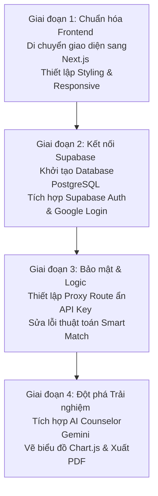

# UniMatch

Website tư vấn chọn nguyện vọng đại học — giao diện **Neo-Brutalism** cho Gen-Z.

## Design tokens

| Token | Value |
|-------|--------|
| Canvas | `#F9F6EE` |
| Border | `3px #000000` |
| Mustard (primary) | `#FFD23F` |
| Scholar Blue | `#3A86FF` |
| Sage Green | `#38B000` |
| Shadow | `5px 5px 0 #000` (no blur) |

Fonts: **Space Grotesk** (display), **Inter** (body).

## Tính năng UI

- Hero: `UNIMATCH: HACK SỐ PHẬN, CHỌN ĐÚNG TRƯỜNG.`
- **Aspiration Matrix**: grid 3fr · 5fr · 2fr (30/50/20), 3 khối bất đối xứng
- Thẻ trường: benchmark score, học phí, lý do match

## Bản đồ (VietMap)

Trang bản đồ **không dùng OpenStreetMap**. UniMatch dùng **VietMap** (bản đồ tuân thủ quy định Việt Nam).

1. Đăng ký API key: https://maps.vietmap.vn/console/register  
2. Điền `apiKey` trong `js/map-config.js` (mẫu: `js/map-config.example.js`)

## Chạy

Mở `index.html` trong trình duyệt. Bản đồ cần mạng (VietMap GL JS).

---

# ĐÁNH GIÁ DỰ ÁN & ĐỊNH HƯỚNG PHÁT TRIỂN (TỪ SENIOR DEVELOPER)

Chào bạn, dưới góc độ của một Senior Developer có hơn 5 năm kinh nghiệm thực chiến phát triển ứng dụng Web/Mobile và hệ thống SaaS, tôi đã rà soát toàn bộ cấu trúc mã nguồn, thiết kế UI/UX và logic nghiệp vụ của dự án **UniMatch**. Dưới đây là bài đánh giá chi tiết cùng kế hoạch hành động tối ưu nhất dành cho bạn để nâng tầm sản phẩm này lên tiêu chuẩn thương mại.

## 1. NHỮNG GÌ DỰ ÁN ĐÃ LÀM TỐT (WHAT HAD BEEN DONE OK)

*   **Ngôn ngữ thiết kế Neo-Brutalism xuất sắc:** Dự án bắt rất đúng trend thiết kế hiện đại của Gen-Z. Cách phối màu tương phản cao (High-contrast), viền border đen dày dặn (`3px`) kết hợp bóng đổ phẳng không mờ (`5px 5px 0 #000`) mang lại cá tính mạnh mẽ, cao cấp và độc đáo so với các trang web giáo dục truyền thống tẻ nhạt.
*   **Chiến lược ma trận nguyện vọng 30/50/20 thực tế:** Thuật toán phân chia ma trận (An toàn -Sweet Spot - Dream) có logic nghiệp vụ cực kỳ tốt. Đây là công thức tư vấn chuẩn xác được áp dụng rộng rãi ngoài đời thực, giúp học sinh tối ưu hóa cơ hội đỗ đại học.
*   **Cấu trúc phân tách dữ liệu rõ ràng (Clean Data Layer):** Việc tách biệt hoàn toàn dữ liệu thô ([js/universities.js](..../BestWebDesign/js/universities.js), [js/majors.js](..../BestWebDesign/js/majors.js)) ra khỏi logic điều khiển và giao diện giúp bạn có thể dễ dàng cắm API thật hoặc kết nối Database ở Backend vào mà không phải sửa lại cấu trúc UI.
*   **Trải nghiệm bản đồ chuẩn chủ quyền:** Việc tích hợp bản đồ **VietMap GL JS** thay vì OpenStreetMap là một điểm cộng cực lớn về mặt chính trị và pháp lý tại Việt Nam, hiển thị rõ ràng và chính xác chủ quyền quốc gia (Hoàng Sa - Trường Sa).
*   **Micro-interactions mượt mà:** Việc bổ sung **Skeleton Loading** nhấp nháy khi tải dữ liệu bản đồ, danh sách và hiệu ứng trượt mượt mà từng phần (**Staggered Fade-in**) giúp ứng dụng mang lại cảm giác phản hồi nhanh, tiệm cận một ứng dụng Single Page App (SPA) chuyên nghiệp.

---

## 2. CÁC PHẦN THIẾT YẾU CẦN BỔ SUNG NGAY (WHAT'S ESSENTIAL SHOULD BE ADDED RIGHT NOW)

Để đưa dự án này từ trạng thái "sản phẩm đồ án" sang "sản phẩm thực tế có người dùng thật", chúng ta cần giải quyết các vấn đề cốt lõi sau:

### A. Tích hợp Backend và Cơ sở dữ liệu thật (Database Integration)
*   **Vấn đề:** Hiện tại mọi dữ liệu điểm chuẩn, học phí đều là tĩnh (hardcoded/seeded random). Nếu dữ liệu tuyển sinh thay đổi, bạn không thể cập nhật tức thời cho hàng ngàn người dùng.
*   **Giải pháp:** Xây dựng hệ thống lưu trữ dữ liệu tập trung và sinh API.
*   **Công nghệ lựa chọn:** 
    *   **Backend:** **Node.js (Next.js)** - Sử dụng Next.js Route Handlers / Server Actions làm Backend Proxy và xử lý các API nghiệp vụ.
    *   **Database:** **Supabase (PostgreSQL)** - Sử dụng PostgreSQL làm cơ sở dữ liệu quan hệ quản lý các bản: Trường ĐH, Ngành học, Điểm chuẩn qua các năm, Tổ hợp xét tuyển.

### B. Hệ thống Tài khoản & Đồng bộ dữ liệu (Authentication & User Persistence)
*   **Vấn đề:** Dữ liệu bookmark trường học và bản nháp nguyện vọng hiện tại đang lưu ở `localStorage`. Nếu học sinh đổi từ điện thoại sang máy tính, toàn bộ chiến lược nguyện vọng đã tạo sẽ biến mất.
*   **Giải pháp:** Xây dựng hệ thống Đăng nhập/Đăng ký.
*   **Công nghệ lựa chọn:** Sử dụng **Supabase Auth** tích hợp **Google OAuth 2.0** để học sinh Gen-Z có thể đăng nhập nhanh bằng tài khoản Google chỉ với 1-click. Toàn bộ nguyện vọng sẽ được lưu trực tiếp trên database Supabase để đồng bộ mọi thiết bị.

### C. Bảo mật API Key VietMap
*   **Vấn đề:** Hiện tại API Key của VietMap đang được ghi trực tiếp ở file cấu hình client-side ([js/map-config.js](..../BestWebDesign/js/map-config.js)). Bất kỳ ai F12 cũng có thể lấy trộm key này để sử dụng, gây phát sinh chi phí hoặc bị khóa tài khoản VietMap của bạn.
*   **Giải pháp:** Triển khai **Proxy Route** ở Backend (sử dụng Next.js Route Handlers). Client sẽ gọi về API nội bộ của Next.js, phía Server sẽ lấy API Key VietMap từ biến môi trường ẩn (`.env`) để fetch bản đồ rồi trả về cho client, giúp che giấu API Key tuyệt đối.

---

## 3. TÍNH NĂNG PHỤ NHƯNG NÂNG TẦM TRẢI NGHIỆM (COOL FEATURES TO ADD)

Đây là những tính năng không bắt buộc ở phiên bản đầu tiên, nhưng nếu tích hợp thành công, sản phẩm của bạn sẽ "đè bẹp" mọi đối thủ cạnh tranh trên thị trường:

*   **Chatbot AI Tư vấn học đường (AI Counselor):**
    *   *Mô tả:* Tích hợp **Gemini API** hoặc **OpenAI API**. Học sinh có thể tâm sự trực tiếp bằng ngôn ngữ tự nhiên (Ví dụ: *"Mình thích vẽ nhưng bố mẹ bắt học kinh tế, điểm thi khối D01 được 24 điểm thì nên chọn ngành gì?"*). AI sẽ phân tích tâm lý, kết hợp dữ liệu điểm chuẩn thực tế để đưa ra lời khuyên cá nhân hóa.
*   **Xuất File PDF Ma trận nguyện vọng:**
    *   *Mô tả:* Thêm nút "Xuất file PDF" tại bước 4 của Smart Match. Hệ thống sẽ kết xuất đồ họa ma trận nguyện vọng 30/50/20 thành một file PDF được thiết kế Brutalism cực kỳ đẹp mắt để học sinh in ra, lưu trữ hoặc gửi cho phụ huynh xem duyệt.
*   **Biểu đồ xu hướng điểm chuẩn (Data Visualization):**
    *   *Mô tả:* Khi so sánh trường hoặc xem chi tiết ngành, vẽ một biểu đồ đường (Line Chart) mô tả xu hướng biến động điểm chuẩn từ 2023 - 2025. Học sinh sẽ thấy ngay ngành này đang "hot" lên (đường đi lên) hay đang bão hòa (đường đi ngang/xuống).
    *   *Công nghệ đề xuất:* **Chart.js** hoặc **Recharts** (gọn nhẹ, tương thích tốt với Brutalism).
*   **High-Contrast Dark Mode (Chế độ tối Brutalism):**
    *   *Mô tả:* Không phải dark mode xám đen thông thường, mà là chế độ tối độ tương phản cao đặc trưng của Brutalism (Nền đen sần cát dính, viền trắng, chữ xanh Neon/Vàng chanh cực kỳ cá tính cho Gen-Z dùng ban đêm).

---

## 4. ĐỀ XUẤT KHẮC PHỤC LỖI THUẬT TOÁN & DỮ LIỆU HIỆN TẠI (BUG FIXES & DATA ALIGNMENT)

Qua rà soát sâu hơn về logic nghiệp vụ chạy bộ lọc (Smart Match) trên giao diện danh sách đơn (Single-list) hiện tại (khi đã bỏ ma trận 3 cột 20/30/50), tôi phát hiện ra 3 lỗi nghiêm trọng trực tiếp dẫn đến hiện tượng **Empty State (trống kết quả)** hoặc hiển thị sai lệch trường học. Dưới đây là phân tích lỗi, đề xuất giải pháp và thứ tự ưu tiên các bước xử lý:

### 4.1. Các lỗi đang tồn tại & Giải pháp tương ứng

- **Lỗi 1: Cắt cụt kết quả trước khi lọc (Lọc hiển thị sai vị trí)**
  - *Nguyên nhân:* Hàm `calculateMatches` lọc dữ liệu thô, sắp xếp theo điểm tương thích giảm dần và cắt lấy top 18. Sau đó, giao diện hiển thị chỉ lọc lấy các trường có nhãn `safe` (An toàn) trong top 18 này. Nếu top 18 chứa toàn trường `reach` (Thử thách) hoặc `fit` (Phù hợp), kết quả hiển thị sẽ bị trống rỗng hoặc cực kỳ ít trường, mặc dù trong CSDL có rất nhiều trường `safe` khác nằm ngoài top 18.
  - *Đề xuất 2 Phương án khắc phục:*
    - **Phương án A (Khuyên dùng - Danh sách hỗn hợp kèm nhãn & bộ lọc nhanh):** Hiển thị cả 3 loại nguyện vọng (An toàn, Phù hợp, Thử thách) trên cùng danh sách đơn. Mỗi thẻ trường gắn nhãn dán màu sắc (🟢 An toàn, 🟡 Phù hợp, 🔴 Thử thách). Thêm bộ lọc Tab `[Tất cả] [🟢 An toàn] [🟡 Phù hợp] [🔴 Thử thách]` ở đầu danh sách để học sinh chuyển đổi nhanh mà không bị mất dữ liệu.
    - **Phương án B (Chỉ hiển thị An toàn - Lọc trước rồi mới cắt):** Sửa thuật toán để lọc lấy các trường có điều kiện `safe` trước, sau đó mới sắp xếp và lấy top 18 trường an toàn nhất để hiển thị.

- **Lỗi 2: Gán sai vùng tuyển sinh miền Bắc/Nam/Trung**
  - *Nguyên nhân:* Hàm `getRegion` kiểm tra chuỗi địa điểm, nếu chứa từ "Hà Nội" thì gán vào miền Bắc (`north`). Các trường đa cơ sở như Đại học Ngoại thương (FTU) lưu địa chỉ `"Hà Nội & TP.HCM"` bị mặc định gán thành `north`. Khi học sinh miền Nam chọn vùng ưu tiên là miền Nam (`south`), FTU sẽ bị ẩn hoàn toàn khỏi kết quả.
  - *Giải pháp:* Cập nhật logic `getRegion` để nhận diện các ký tự liên kết hoặc cụm từ thể hiện đa cơ sở (như `&`, `và`, `Nhiều cơ sở`, `toàn quốc`) và gán vùng miền là `"all"`.

- **Lỗi 3: Không khớp mã nhóm ngành giữa danh mục và CSDL trường**
  - *Nguyên nhân:* Dữ liệu trường học ở `universities.js` chứa các mã nhóm ngành thô như `"toan"`, `"co_khi"`, `"dien"`, `"tai_chinh"`, `"kinh_te"`, `"marketing"`, `"duoc"`, `"y_te"`, `"giao_duc"`, `"nnl"`. Trong khi đó, `app-data.js` chỉ định nghĩa và tìm kiếm theo 10 mã ngành chuẩn (`"cntt"`, `"kinhte"`, `"yte"`, `"kysu"`, `"sudp"`, `"luat"`, `"nn"`, `"design"`, `"nonglam"`, `"xaydung"`). Việc lệch mã ngành khiến thuật toán không tạo được điểm chuẩn và lọc sai kết quả.
  - *Giải pháp:* Xây dựng hàm `normalizeCategories` để chuẩn hóa các nhóm ngành thô về 10 nhóm ngành chuẩn trong `app-data.js` trước khi xử lý logic so khớp.

---

### 4.2. Thứ tự ưu tiên thực hiện các bước (Priority Steps Roadmap)

Để giải quyết triệt để vấn đề mà không phá vỡ cấu trúc hiện tại, chúng ta nên thực hiện theo lộ trình ưu tiên từ dễ đến khó, từ dữ liệu đến thuật toán như sau:

#### 📌 Bước 1: Chuẩn hóa dữ liệu thô (Ưu tiên cao nhất - Thực hiện ngay)

- **Nhiệm vụ:** Sửa lỗi gán vùng miền của trường đa cơ sở và chuẩn hóa khớp mã nhóm ngành.
- **Lý do làm trước:** Đây là nền tảng. Nếu dữ liệu đầu vào bị gán sai vùng hoặc lệch mã ngành, mọi thuật toán lọc phía sau đều hoạt động sai lệch và không thể trả về đúng kết quả.
- **Cách làm:** Cập nhật hàm `getRegion` và triển khai hàm `normalizeCategories` trong `js/app-data.js`.

#### 📌 Bước 2: Sửa thuật toán lọc và phân loại kết quả (Thực hiện tiếp theo)

- **Nhiệm vụ:** Sửa đổi hàm `calculateMatches` trong `js/app.js` theo phương án đã chọn (Phương án A hoặc Phương án B).
- **Lý do làm thứ hai:** Sau khi dữ liệu đã chuẩn, ta sửa thuật toán để đảm bảo kết quả tính toán trả về đầy đủ, chính xác, giải quyết triệt để lỗi "nuốt kết quả" (Empty State).

#### 📌 Bước 3: Cập nhật giao diện hiển thị trên danh sách đơn (Thực hiện sau cùng)

- **Nhiệm vụ:** Cập nhật hàm `renderResultCard` để bổ sung nhãn dán màu sắc (nếu theo Phương án A) và viết hàm lọc nhanh (Tab) trên giao diện kết quả.
- **Lý do làm sau cùng:** Đây là bước hoàn thiện UI/UX dựa trên dữ liệu và thuật toán đã được sửa đổi và kiểm tra chạy tốt từ hai bước trên.

---

## 📅 LỘ TRÌNH DỰ KIẾN (THE ACTION PLAN)

Hy vọng bản đánh giá và kế hoạch hành động chuyên sâu này sẽ giúp bạn định hình rõ nét con đường phát triển tiếp theo của dự án **UniMatch**. Chúc dự án của bạn thành công vang dội!
